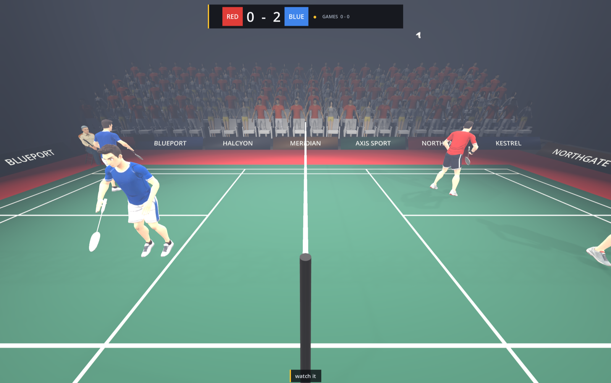
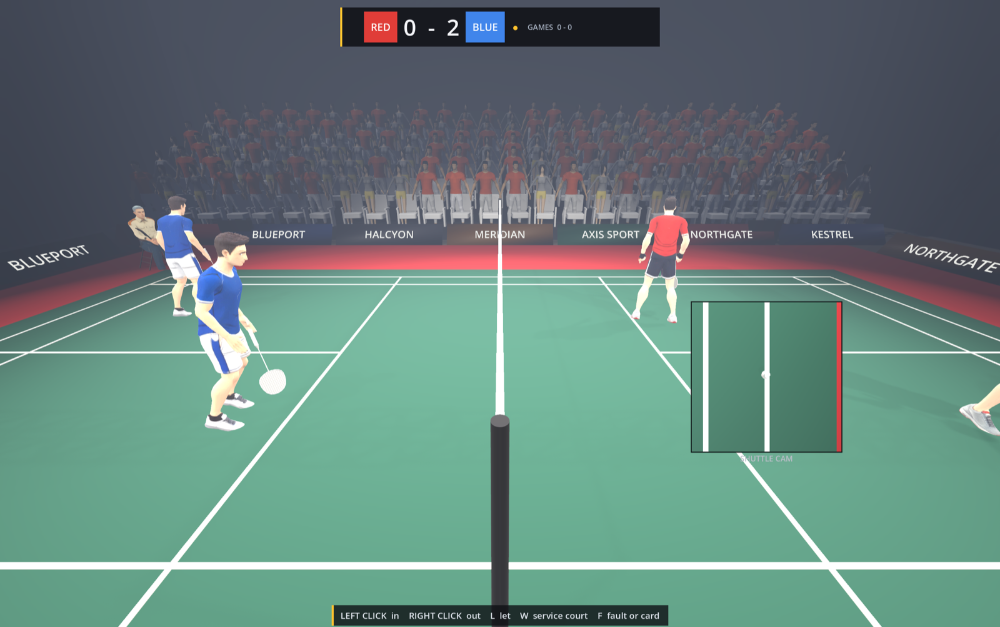
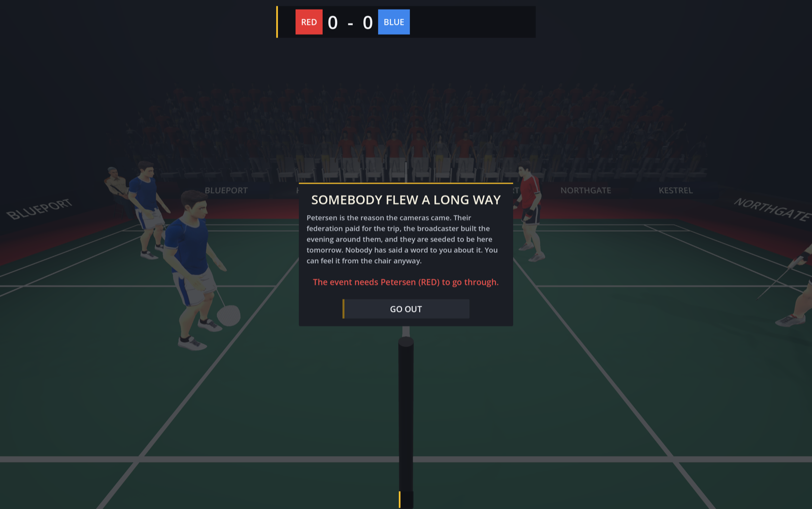
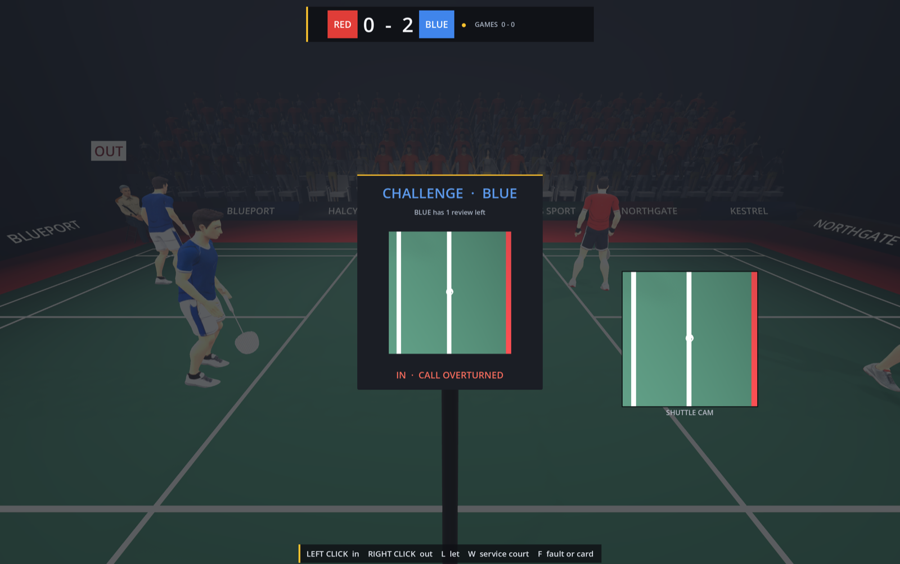

# Referee For Fun

**A 3D game where you are the umpire, not the athlete.**

You sit in the chair and the match is played in front of you with real physics, so the
game already knows exactly where the shuttle landed, to the millimetre. It is never
going to tell you. Your job is to say what happened — and nothing in the game requires
that to be true.

Godot 4.7.2 · GDScript · desktop, keyboard and mouse

---

## The idea

Most sports games ask whether you can play. This one asks whether you can be trusted.

The interesting part is not that you *can* cheat. It is that the game never tells you
whether you got away with it. **There is no suspicion meter anywhere and there never
will be.** The only feedback is the room: how the crowd sounds, whether a coach stands
up, whether the player whose point you just took turns round and argues with the chair.
You are always guessing, which is exactly the position the job puts you in.

That one rule drives everything else. A shuttle two centimetres out called IN is a
matter of opinion — nobody in the building can be certain, so it barely costs you. One
that lands a metre out and is given in costs you a great deal. And what really gets an
umpire caught is not being wrong; it is **being wrong in the same direction every
time.** Mistakes that go both ways look like incompetence. Mistakes that all help the
same side look bought.

The shuttle has landed. The camera on the line shows you the overhead view, the two line
judges have said what they saw, and the hall is waiting. Left click for IN, right click
for OUT — and the longer you sit there, the more it looks like you are deciding which
answer suits you rather than what happened.

## What is in it

|  |  |
|---|---|
| **The rally** | Four rigged athletes, thirteen badminton animations, a shuttlecock with its own drag model. Shots are aimed at chosen targets — usually a few centimetres from a line — because honest shot selection would put most shuttles safely inside the court, where there is nothing to judge. |
| **The calls** | IN, OUT, LET, and the four faults: net touch, carry, double hit, obstruction. Every fault has both a recorded truth and something visible on court — the net shakes, the shuttle sticks on the racket for a moment, a player genuinely reaches over the net. Ignoring one is itself a lie. |
| **The service courts** | Full doubles rotation: even score serves from the right, odd from the left, always diagonally. Somebody occasionally lines up wrong, and you can call it. |
| **Line judges** | Two of them, at diagonally opposite corners, so the pair see all four boundary lines between them. They are wrong about as often as a coin on the close ones — which is what makes them useful. Agree with a mistake and the blame is shared with an official in plain sight. Overrule them and the hall has watched two officials disagree, with only your call left standing. |
| **Hawk-Eye** | From the national championship up. Two reviews a side per game, a successful one handed back. The load-bearing design choice is that players sometimes challenge a call you got *right* — otherwise CHALLENGE would be a verdict announced in advance. |
| **A career** | School hall → district → state → national → international. Reputation persists between matches, and the same lie is nearly free at the bottom and career-ending at the top. |
| **A reason to lie** | Four of them, and none is money. See below. |

## Why you would ever lie

The obvious answer is a bribe, and there are deliberately none in this game. An envelope
makes the umpire a criminal, and once they are a criminal the only interesting question
— *would you?* — has already been answered for the player.

Instead you get told, in a corridor, before you go out:

- **The tournament** needs a particular name in the final. Nobody asks you for anything.
- **The appointments panel** is in the hall with your file open. They cannot mark your
  accuracy — nobody in that chair can. They are marking whether anything *happened*,
  which pushes you towards the popular call rather than the correct one.
- **A grudge**: a player you refereed badly in an earlier match is here, carried in your
  save file, wearing either colour, and quicker to challenge you than anybody else.
- **A debt**: your own first plainly wrong call, and the pull to put it right by getting
  a second one wrong the other way.

The rule that keeps this from being a bribe with the serial numbers filed off is that
**the reward is always for the result, never for the lie.** If the tournament's player
wins fairly you are thanked exactly the same. Measured over ten clean matches, an umpire
leaned on every week climbs the ladder as fast as one nobody ever spoke to.

## The one moment the truth is public

Everything an umpire does here is deniable, until it is not.

## Running it

Open the project in **Godot 4.7.2** and run `scenes/match.tscn`. That is the only scene
the game runs; the court, the hall, the crowd and the whole interface are built in code.

The 3D models are not in this repository — they are large binaries under Creative
Commons Attribution, and every one is credited with its source URL in
[`CREDITS.md`](CREDITS.md). Fetch them with the `sketchfab` CLI, or play with the
fallback figures, which are deliberately built in: a game that will not start because a
model is missing is worse than a game with a box in it.

## Layout

| Folder | Contents |
|---|---|
| `scenes/` | `match.tscn`, the one scene the game runs. |
| `scripts/` | All the GDScript: the rally, the calls, suspicion, the career, the hall, the interface. |
| `assets/` | Models, audio and interface art, filed by where each came from. |
| `tools/` | Scripts that *make* assets — Blender rigging, Meshy generation, and a sound synthesiser that writes every WAV in the game from pure Python. Not shipped. |
| `dev/` | Scenes that look at the game rather than being part of it. See [`dev/README.md`](dev/README.md). |
| `docs/` | The pictures on this page, generated by `dev/_readme.tscn` so they can be retaken rather than slowly becoming a photograph of a version nobody can play. |

## On the `dev/` folder

A game about millimetres cannot be checked by eye, so most of it is checked by a scene
that drives the game from outside and prints numbers. Almost every real bug in this
project was found by one of them disagreeing with what the screen appeared to show — a
shuttle landing a centimetre *inside* the floor, a crowd stretched five times its
height, a racket balanced across a player's fist, a whistle that measured 0 Hz.

The most useful one answers a question no amount of playing would settle: **does an
honest umpire get punished?** It plays a full match calling nothing but the truth and
reports what the game charged for it. It has caught four separate bugs that did exactly
that, including one where a doubles serve was judged against the back line at 6.70 m
instead of the long service line at 5.94 m — so every serve landing in the 76 cm between
them was scored good, and calling it out was recorded as a lie.

---

Badminton first. Volleyball second — the referee systems were written to be
sport-agnostic on purpose.
